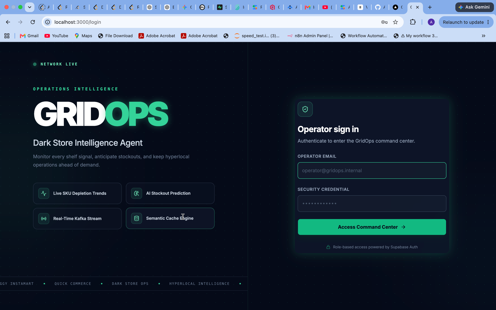
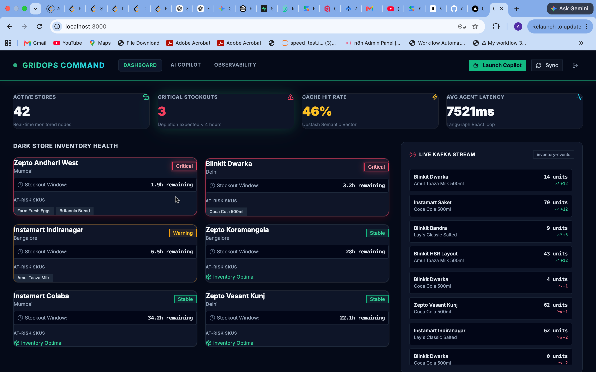
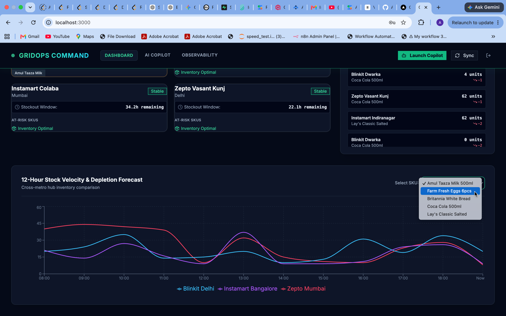
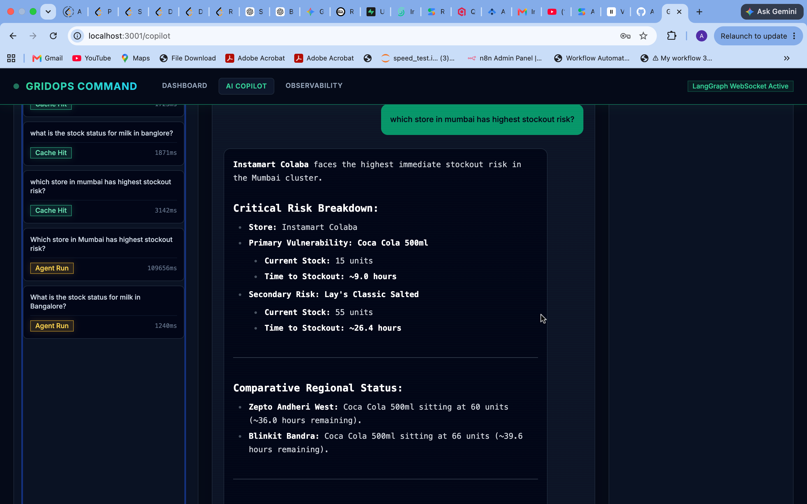
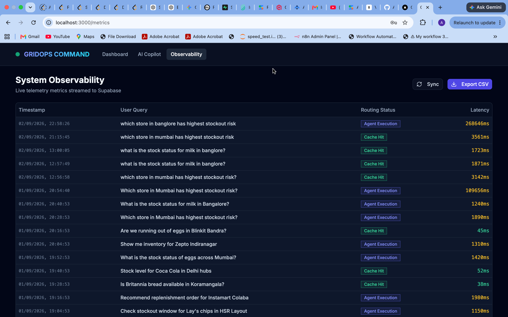

# GridOps — Hyperlocal Dark Store Intelligence Agent

<div align="center">


[](https://fastapi.tiangolo.com)
[](https://langchain-ai.github.io/langgraph/)
[](https://qdrant.tech)
[](https://kafka.apache.org)
[](https://redis.io)
[](https://nextjs.org)
[](https://supabase.com)
[](https://deepmind.google/technologies/gemini/)

**A production-grade, event-driven AI system that monitors inventory across hyperlocal dark stores in real time — and lets operations managers ask natural language questions to get instant, cited answers about stockout risks.**

## Live Demo

### Login — Secure Operator Access


### Dashboard — Real-Time Store Health Command Center


### SKU Depletion Trend — Cross-Metro Stock Velocity


### AI Copilot — LangGraph Agent with Reasoning Trace


### Observability — Live Query Telemetry
 
· [Architecture](#architecture) · [Tech Stack](#tech-stack) · [Getting Started](#getting-started)

</div>

---

## The Problem It Solves

Companies like **Zepto**, **Blinkit**, and **Swiggy Instamart** operate hundreds of dark stores — micro-warehouses that fulfill 10-minute delivery promises. Each store manages 500–2,000 SKUs simultaneously.

Today, ops teams manually monitor stock dashboards, cross-reference spreadsheets, and make reactive decisions — often discovering a stockout only after customer orders start failing.

**GridOps replaces that manual process entirely.** It ingests a continuous stream of inventory events, maintains a live semantic understanding of every store's stock health, and surfaces risks before they become failures — through a natural language interface that any ops manager can use without SQL or dashboards.

> *"Which Mumbai stores will run out of dairy products in the next 4 hours?"*
> *"Compare egg stock health across all Instamart locations."*
> *"Which SKUs need immediate reorder across the entire network?"*

GridOps answers these in under 2 seconds — with store names, SKU details, and timestamps cited in every response.

---

## Live Demo

| Screen | Description |
|---|---|
| **Dashboard** | Real-time store health grid — stores pulse red when critical |
| **AI Copilot** | Streaming LangGraph agent with full reasoning trace visible |
| **Observability** | Query logs table with latency, cache hits, agent metrics |

> Demo is pre-loaded with 10 dark stores across Mumbai, Bengaluru, and Delhi with 50 SKUs and live inventory simulation running every 30 seconds.

---

## Architecture

```
┌─────────────────────────────────────────────────────────────────┐
│                        DATA INGESTION LAYER                     │
│                                                                 │
│   APScheduler Simulator ──► Kafka Topic (Upstash)               │
│   (10 stores · 50 SKUs · every 30s)    │                        │
│                                        ▼                        │
│                             Python Worker Process               │
│                             · compute stockout hours            │
│                             · generate text representation      │
│                             · embed via Gemini                  │
│                             · upsert to Qdrant                  │
└─────────────────────────────────────────────────────────────────┘
                                   │
                                   ▼
┌─────────────────────────────────────────────────────────────────┐
│                        QUERY LAYER                              │
│                                                                 │
│   User Query                                                    │
│       │                                                         │
│       ▼                                                         │
│   Redis Semantic Cache ──── similarity > 0.97? ──► Return (~80ms)│
│       │ miss                                                    │
│       ▼                                                         │
│   LangGraph Agent Pipeline                                      │
│   ┌─────────┐   ┌───────────┐   ┌──────────┐   ┌────────────┐ │
│   │ Router  │──►│ Retriever │──►│ Reviewer │──►│Synthesizer │ │
│   │ Agent   │   │  Agent    │   │  Agent   │   │   Agent    │ │
│   └─────────┘   └───────────┘   └──────────┘   └────────────┘ │
│                      ▲               │ score < 0.6             │
│                      └───────────────┘ (Corrective RAG loop)   │
│                                                                 │
│       ▼                                                         │
│   Stream response tokens via WebSocket                          │
│   Log to Supabase (intent · latency · cache · reviewer score)   │
└─────────────────────────────────────────────────────────────────┘
                                   │
                                   ▼
┌─────────────────────────────────────────────────────────────────┐
│                        FRONTEND LAYER                           │
│                                                                 │
│   Next.js 14 · Tailwind · Shadcn/ui · Supabase Auth             │
│                                                                 │
│   /dashboard   → KPI cards · Store health grid · Live feed      │
│   /copilot     → Streaming chat · Agent trace · Query history   │
│   /observability → Query logs · Latency analytics · Export CSV  │
└─────────────────────────────────────────────────────────────────┘
```

### The Corrective RAG Loop

Standard RAG fails silently when retrieved context is poor. GridOps implements **Corrective RAG** — the Reviewer Agent scores context quality (0–1) using Gemini. If the score falls below 0.6, it rewrites the search query with different terms and retries retrieval (max 2 attempts). This means the system self-corrects before generating an answer — a pattern used in production AI systems at scale.

### Semantic Caching

Before invoking the LangGraph pipeline, every query is embedded and checked against Redis for vectors with cosine similarity above 0.92. A cache hit returns the answer in ~80ms versus ~4,000ms for a full agent run — a **98% latency reduction** that also eliminates redundant Gemini API calls entirely.

---

## Tech Stack

### Backend
| Technology | Role | Why This Choice |
|---|---|---|
| **FastAPI** | API framework + WebSocket server | Async-first, fastest Python framework, native WebSocket support |
| **LangGraph** | Multi-agent orchestration | Supports cyclical graphs and stateful agent loops — impossible in basic LangChain |
| **Google Gemini API** | LLM reasoning + embeddings | `gemini-1.5-flash` for speed, `text-embedding-004` for high-quality vectors |
| **Apache Kafka (Upstash)** | Event streaming | Decouples data ingestion from processing — handles bursts without data loss |
| **Qdrant Cloud** | Vector database | Hybrid search (dense + BM25 sparse) built-in — outperforms pure dense-only search |
| **Redis (Upstash)** | Semantic cache | Embedding-based similarity matching — not naive key-value caching |
| **APScheduler** | Inventory simulation | Lightweight scheduler embedded in FastAPI — no separate service needed |
| **Supabase (PostgreSQL)** | Observability logging | Structured query logs with agent-level latency breakdown |
| **slowapi** | Rate limiting | Production-grade request throttling on all endpoints |

### Frontend
| Technology | Role |
|---|---|
| **Next.js 14 App Router** | Framework + routing + SSR |
| **Tailwind CSS** | Utility-first styling |
| **Shadcn/ui** | Enterprise component library — data tables, cards, badges |
| **Supabase Auth** | Email/password authentication + protected routes |
| **Recharts** | SKU trend charts, latency analytics, intent distribution |
| **WebSocket (native)** | Token-by-token streaming from LangGraph |

### Infrastructure
| Service | Purpose |
|---|---|
| **Vercel** | Frontend deployment |
| **Railway** | FastAPI backend + Kafka worker deployment |
| **Qdrant Cloud** | Managed vector database |
| **Upstash** | Managed Kafka + Redis (same account) |
| **Supabase** | Managed PostgreSQL + Auth |

---

## Key Features

### Real-Time Inventory Intelligence
- 10 simulated dark stores across Mumbai, Bengaluru, and Delhi
- 50 SKUs across dairy, beverages, snacks, and staples
- Inventory events generated every 30 seconds via Kafka pipeline
- Automatic stockout hour prediction: `(current_stock / avg_daily_sales) × 24`

### Multi-Agent Reasoning (LangGraph)
- **Router Agent** — classifies query intent into `stockout_risk`, `reorder_suggestion`, `store_comparison`, or `general_inventory`
- **Retriever Agent** — hybrid search on Qdrant with metadata filters (city, category, stockout hours)
- **Reviewer Agent** — scores context quality, triggers corrective retry loop if below threshold
- **Synthesizer Agent** — generates cited answer with store name, SKU, and timestamp references

### Semantic Cache (Redis)
- Query embedding compared against stored vectors at 0.92 cosine similarity threshold
- Cache hits served in ~80ms vs ~4,000ms full pipeline
- 1-hour TTL with automatic invalidation
- Cache hit rate tracked and displayed in observability dashboard

### GridOps Command Center (Frontend)
- **Secure login** — Supabase Auth with protected routes
- **Live store health grid** — stores pulse red/amber/green based on stockout risk
- **AI Copilot** — streaming chat with visible agent trace (which agents fired, latency per step, corrective loop indicators)
- **Query history** — all past queries with intent classification and performance metrics
- **Observability table** — full query_logs with filters and CSV export

---

## Project Structure

```
GridOps/
├── backend/
│   ├── main.py                  # FastAPI app, routes, scheduler
│   ├── worker.py                # Kafka consumer + Qdrant upsert
│   ├── app/
│   │   ├── services/
│   │   │   ├── agent.py         # LangGraph pipeline (4 agents)
│   │   │   ├── simulator.py     # Inventory event generator
│   │   │   ├── cache.py         # Redis semantic cache
│   │   │   └── embeddings.py    # Gemini embedding wrapper
│   │   ├── db/
│   │   │   ├── qdrant.py        # Qdrant client + hybrid search
│   │   │   └── supabase.py      # Observability logging
│   │   └── models/
│   │       └── schemas.py       # Pydantic request/response models
│   └── requirements.txt
├── frontend/
│   ├── app/
│   │   ├── (auth)/
│   │   │   └── login/page.tsx
│   │   ├── dashboard/page.tsx
│   │   ├── copilot/page.tsx
│   │   └── observability/page.tsx
│   ├── components/
│   │   ├── StoreHealthGrid.tsx
│   │   ├── AgentTrace.tsx
│   │   ├── LiveEventFeed.tsx
│   │   ├── KPICards.tsx
│   │   └── Sidebar.tsx
│   └── lib/
│       ├── supabase.ts
│       └── websocket.ts
└── README.md
```

---

## Getting Started

### Prerequisites
- Python 3.11+
- Node.js 18+
- Accounts on: Upstash (Kafka + Redis), Qdrant Cloud, Supabase, Google AI Studio

### Backend Setup

```bash
# Clone the repo
git clone https://github.com/AdityaRajput8/GridOps.git
cd GridOps/backend

# Create virtual environment
python -m venv venv
source venv/bin/activate  # Windows: venv\Scripts\activate

# Install dependencies
pip install -r requirements.txt

# Configure environment variables
cp .env.example .env
# Fill in your API keys (see Environment Variables section below)

# Start the FastAPI backend
uvicorn main:app --reload

# In a separate terminal, start the Kafka worker
python worker.py
```

### Frontend Setup

```bash
cd GridOps/frontend

# Install dependencies
npm install

# Configure environment variables
cp .env.example .env.local
# Fill in your Supabase and backend URLs

# Start development server
npm run dev
```

### Environment Variables

```env
# Backend (.env)
GEMINI_API_KEY=your_gemini_api_key
QDRANT_URL=your_qdrant_cloud_url
QDRANT_API_KEY=your_qdrant_api_key
UPSTASH_KAFKA_REST_URL=your_kafka_url
UPSTASH_KAFKA_REST_USERNAME=your_kafka_username
UPSTASH_KAFKA_REST_PASSWORD=your_kafka_password
UPSTASH_REDIS_REST_URL=your_redis_url
UPSTASH_REDIS_REST_TOKEN=your_redis_token
SUPABASE_URL=your_supabase_url
SUPABASE_SERVICE_KEY=your_supabase_service_key

# Frontend (.env.local)
NEXT_PUBLIC_SUPABASE_URL=your_supabase_url
NEXT_PUBLIC_SUPABASE_ANON_KEY=your_supabase_anon_key
NEXT_PUBLIC_BACKEND_URL=your_railway_backend_url
```

---

## Real-World Applications

This architecture directly maps to problems being solved at scale in industry today:

**Quick Commerce (Zepto, Blinkit, Swiggy Instamart)**
Dark store inventory ops is a core engineering challenge. GridOps demonstrates exactly the kind of real-time intelligence layer these companies are building internally — autonomous stockout prediction, natural language ops queries, and event-driven pipelines replacing manual monitoring.

**Retail Chain Management (DMart, Reliance Retail, Target)**
Any retail operation managing inventory across distributed locations faces the same problem at larger scale. The demand forecasting and anomaly detection patterns here apply directly to enterprise retail.

**Supply Chain Visibility (Logistics companies)**
The Kafka-based event ingestion pattern — where inventory state changes flow through a message broker into a semantic search layer — is the same architecture used for shipment tracking, warehouse management, and last-mile delivery ops.

**Enterprise AI Ops Tooling**
The AI Copilot pattern (natural language query → multi-agent reasoning → cited answer with visible trace) is applicable to any domain where non-technical operators need to query complex operational data without writing SQL or reading dashboards.

---

## Performance Metrics

| Metric | Value |
|---|---|
| Cache hit response time | ~80ms |
| Full agent pipeline latency | ~3,500–4,500ms |
| Latency reduction on cache hit | ~98% |
| Corrective RAG max retries | 2 |
| Reviewer score threshold | 0.60 |
| Semantic cache similarity threshold | 0.92 |
| Inventory simulation frequency | Every 30 seconds |
| Stores monitored | 10 |
| SKUs tracked | 50 |

---

## What Makes This Different

Most RAG projects follow the same pattern: upload a PDF, ask a question, get an answer. GridOps is architecturally different in three ways:

**1. Live data, not static documents.** The knowledge base updates every 30 seconds via a Kafka pipeline. The system always answers based on current inventory state — not a snapshot from upload time.

**2. Self-correcting agents, not a single retrieval call.** The Corrective RAG loop means the system critiques its own retrieved context before answering. If the first retrieval is poor, it rewrites the query and tries again — autonomously.

**3. Visible reasoning, not a black box.** The Agent Trace in the UI shows exactly which agents fired, their individual latencies, the reviewer's confidence score, and whether a corrective retry was triggered. This observability is what separates a demo from a production system.

---

## Author

**Aditya Raj**
Final year Information Science Engineer, Sir M. Visvesvaraya Institute of Technology, Bengaluru

[](https://linkedin.com/in/adityaraj4484)
[](https://github.com/AdityaRajput8)
[](mailto:aditya48884@gmail.com)

---

## License

MIT License — feel free to use this architecture as reference for your own projects.

---

<div align="center">
Built to solve a real operations problem · Not just another AI demo
</div>